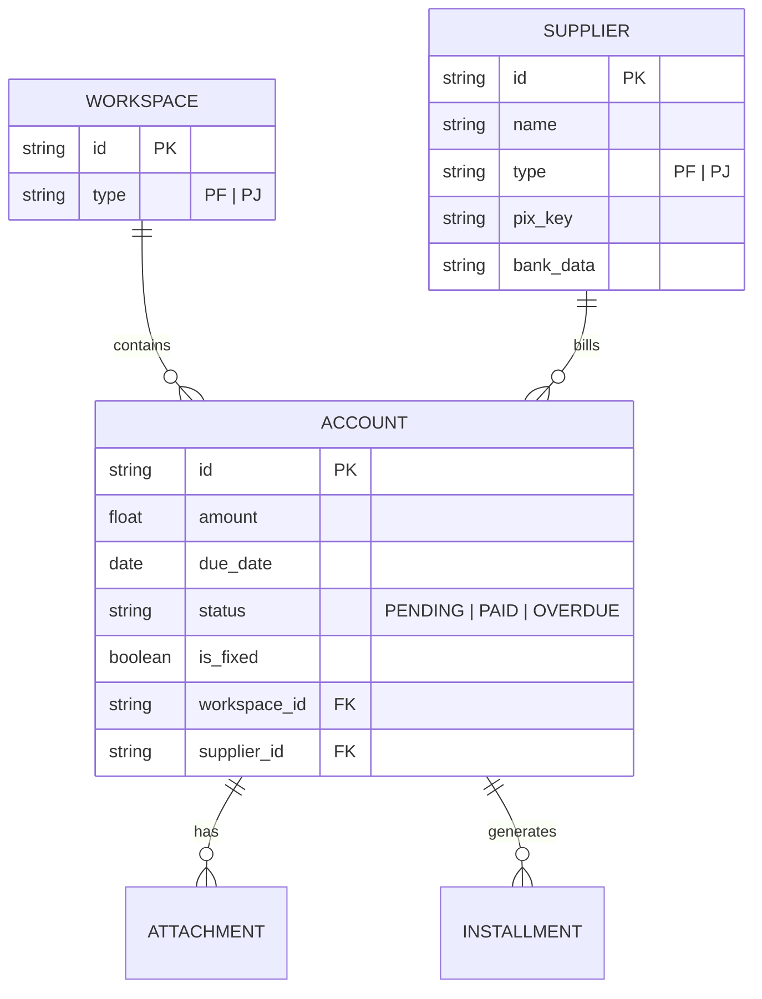

# Especificação Técnica - Tesla Pay

## 1. Arquitetura Recomendada
**Stack:** Next.js + TypeScript + Prisma + PostgreSQL + Tailwind.
**Justificativa:** 
- **Type Safety:** Crucial para dados financeiros.
- **Velocidade:** SSR/ISR para carregamento instantâneo do dashboard.
- **Tailwind:** Facilita a criação da UI "Apple-like" de alta fidelidade sem CSS complexo.

## 2. Modelo de Dados (ERD)

## 3. Endpoints Principais (Proposta REST/Server Actions)
- `POST /api/accounts`: Cria novo lançamento (com lógica de parcelamento).
- `PATCH /api/accounts/:id/pay`: Efetua a baixa e vincula comprovante.
- `GET /api/dashboard/summary`: Retorna KPIs baseados no workspace ativo.
- `GET /api/suppliers/suggest?q=...`: Autocomplete para busca de fornecedores.

## 4. Plano de MVP (Sprints)
- **Sprint 1 (Fundação):** Setup de rotas, banco de dados e UI base do Dashboard.
- **Sprint 2 (Core):** Lançamento de contas, Gestão de Fornecedores e Filtros de Workspace.
- **Sprint 3 (Financeiro):** Fluxo de baixa (pagamento), Upload de anexos e Alertas.
- **Sprint 4 (Polimento):** Gráficos, Exportação CSV e Responsividade Mobile.

## 5. Auditoria e Segurança
- Tabela `audit_logs` registrando: `user_id, action, entity, old_values, new_values, timestamp`.
- Backup diário automatizado via DB managed service (ex: Supabase/Neon).
